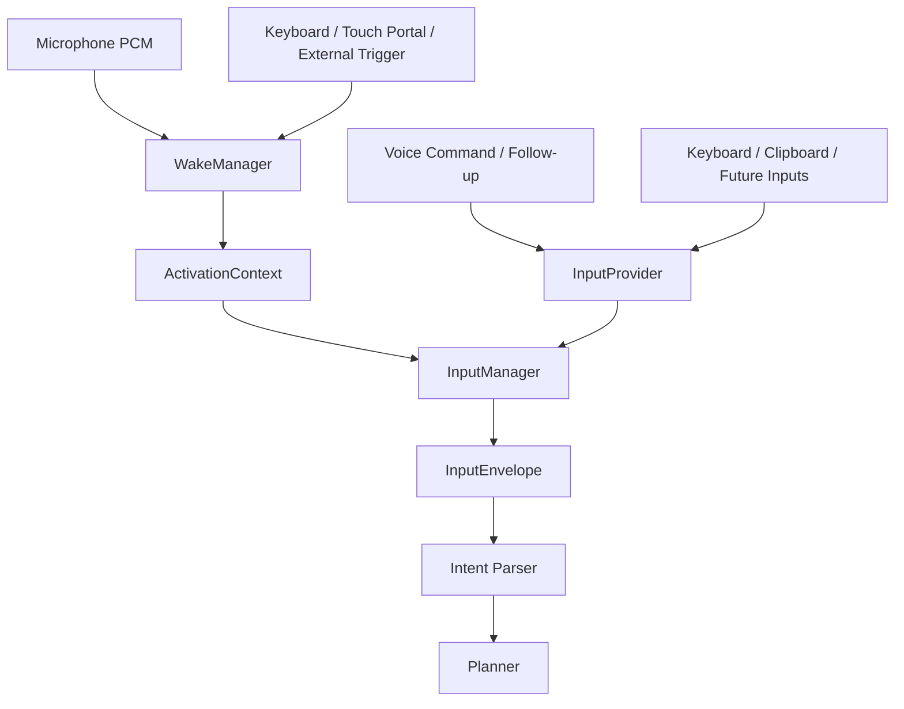

# Input And Wake Manager

Sprint 19 places a provider-driven Wake layer before normalized input.



## Wake Providers

`WakeManager` accepts providers with a common `poll()` contract and selects the
first event allowed by `WakeProfile` priority:

1. Double clap
2. Voice wake phrase
3. Keyboard hotkey
4. Touch Portal
5. Mobile
6. API

Methods are independently enabled. BLE can be added without changing Planner
or Voice Pipeline.

The live Voice entry point opens one shared `sounddevice` stream only while
waiting for wake. The stream feeds both the double-clap detector and a short
speech segmenter, then closes before command STT opens the microphone.

Voice wake accepts spoken `자비스`, `헤이 자비스`, and `hey jarvis`.
Only a short speech candidate is transcribed, and only an exact configured
phrase creates a Wake event. There is no `Wake word >` console listener in the
live runtime. Clap audio is rejected by minimum speech duration and is never
sent to STT or stored.

The current keyboard, Touch Portal, Mobile, and API providers are trigger
boundaries. Platform-specific global hotkey and network listeners remain
separate adapters; they call `trigger()` and do not bypass Wake policy.

## Clap Safety

`ClapDetector` requires:

- a peak and RMS above configurable thresholds;
- a high crest factor to reject sustained speech or music;
- a refractory interval to avoid counting one impulse twice;
- a minimum and maximum interval between the two impulses.
- a settle window covering the full valid clap interval after the second
  impulse; any third impulse in that window cancels the pending activation.

One clap never activates Jarvis. Three rapid claps are rejected instead of
activating on the first two. Real-room calibration is stored per device.
The Wake profile supports `clap_peak_threshold`, `clap_rms_threshold`,
`clap_crest_factor_threshold`, `clap_min_gap_seconds`,
`clap_max_gap_seconds`, and `clap_settle_seconds`.
The default settle window is 0.5 seconds, trading a small Wake delay for
reliable rejection of naturally paced triple claps.

`python scripts\wake_calibration.py` records a noise sample and five valid
Double Clap trials. Every trial must contain exactly two detected clap
candidates; incomplete trials retry and cannot produce a profile. The wizard
stores only derived features in `data/wake_calibration.json`, never audio.

Debug Trace exposes the live state without microphone content:

```text
[Wake] state=WAKE_LISTENING monitor=ON
[Clap] state=FIRST_CLAP
[Clap] state=DOUBLE_PENDING
[Clap] state=TRIPLE_CANCELLED
[Clap] state=CONFIRMED
[Wake] state=ACTIVATED monitor=OFF
```

## Runtime Hardening

- Wake capture stops immediately after one provider wins. It remains stopped
  during command STT, TTS playback, and Follow-up Listening, preventing TTS
  self-activation.
- Pending events from simultaneous providers are cleared before the next Wake
  session, so Clap and Voice cannot cause a duplicate activation.
- Follow-up speech belongs to the active conversation and does not require or
  consume a new Wake event.
- `voice.input.envelope` Trace contains only source, modality, activation
  provenance, content length, and fingerprint. It never contains raw input.

## Input Envelope

Voice, Keyboard, and Clipboard inputs plus OCR, Image, File, Mobile, and API
provider boundaries normalize through `InputManager.ingest()` into an immutable
`InputEnvelope`. The console keyboard path and every Voice turn, including
follow-up and confirmation speech, use this same gate.

The envelope contains source, modality, input type, correlation context,
typed metadata, and a content fingerprint. `to_dict()` excludes raw content
unless a caller explicitly requests it. Raw input must not be written to
operational logs.

`ActivationContext` generalizes how Jarvis was activated:

```text
activation_type
activation_provider
activation_phrase
activated_at
confidence
activation_id
```

Wake Word, double clap, hotkey, and external triggers therefore share one
Planner-independent contract. The legacy `wake_method` and `wake_provider`
fields remain readable during migration but are derived compatibility data.

## Input Providers

`InputProvider.read()` returns provider-neutral `ProviderInput`. Keyboard and
Clipboard use queue adapters today; platform callbacks submit content without
calling Planner directly. OCR, Image, File, and Mobile adapters are explicit
stubs with stable source and modality declarations.

## Runtime Contract

`WakeManager.wait_for_wake_word()` preserves the existing Voice Pipeline
interface. Tests may still use `WakeWordProvider.feed_text()` directly, but the
live provider receives text only from microphone wake transcription.

## Sprint 19 Closure

Sprint 19.1 delivered the common Wake and Input contracts. Sprint 19.2 absorbed
the planned 19.3 Integration and Diagnostics scope by completing the live
Wake-to-Planner path, detector diagnostics, calibration, and regression matrix.

The final measured room baseline was:

- Double Clap: `9/10` confirmed;
- Single Clap: `10/10` with zero activation;
- Triple Clap: `5/5` cancelled;
- keyboard typing, desk impact, door close, and measured media: zero activation;
- detector exceptions and duplicate activations: zero.

Door-close input reached `DOUBLE_PENDING` once and was cancelled by the third
transient. This is an accepted low-frequency residual risk, not a guarantee for
all rooms or microphones. Recalibration and the live probe remain the supported
response if a real false activation is observed.
