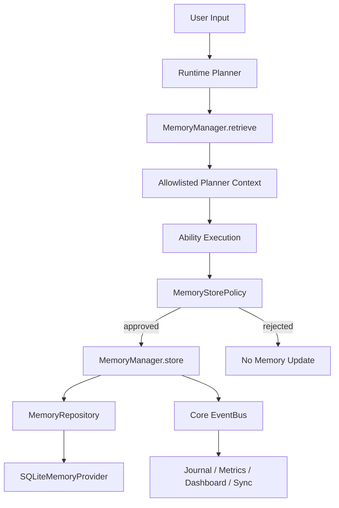

# Memory System

Sprint 20 introduces one structured Memory entry point without deleting the
proven JSON Memory Ability or conversation context.



## Contracts

`MemoryManager` is the application entry point. It owns retrieval, working
memory cleanup, explicit storage, and post-execution policy evaluation.

`MemoryRepository` is the provider-neutral persistence contract. SQLite is the
Sprint 20 provider; cloud, vector, and graph implementations can replace it
without changing Planner or Ability code.

`MemoryRecord` stores a canonical key, value, type, scope, session ID, source,
source provider, creator, confidence, optional expiry, timestamps, and
operational metadata. Supported types are:

- `working`
- `long_term`
- `preference`
- `personal_lexicon`
- `correction`
- `entity_graph`

Personal Lexicon, Correction Memory, Entity Graph, and Cloud Provider are typed
stubs in this sprint.

## Working Memory

Working Memory uses the same Repository with a required `session_id`. Retrieval
includes only the current session plus durable records. Working records expire
after 30 minutes by default, expired records are purged before retrieval, and
`clear_working()` removes only the current session. The Voice runtime also
clears its Working Memory when the process session ends.

RuntimeTask ConversationContext remains authoritative for pending questions,
confirmations, selections, and artifacts. Memory System does not take ownership
of those execution details.

## Store Policy

Memory is not a transcript archive. `MemoryStorePolicy` starts conservatively:

- explicit durable preferences are stored as `preference`;
- user and named-person residence facts are stored as `long_term`;
- blank, one-off, and unclassified statements are rejected;
- only successful Ability executions can produce automatic post-execution
  updates.

Examples:

```text
"오늘 점심은 김치찌개 먹었어." -> reject
"앞으로 기본 날씨는 강릉으로 해줘." -> preference.weather.default_location
"아야는 오사카에 살아." -> relationship.아야.location
```

## Planner Boundary

Planner retrieves Memory before execution, but only an explicit allowlist can
alter a Plan. Sprint 20 applies `preference.weather.default_location` to a
Weather step when the user did not specify a location.

Raw stored values are not copied wholesale into Plan diagnostics or Execution
Journal metadata. Trace records keys, types, counts, reasons, and value lengths.

## Events And Provenance

`MemoryManager` publishes `MemoryStored`, `MemoryUpdated`, `MemoryDeleted`,
`MemoryRetrieved`, and the preference-specific `PreferenceChanged` through the
same Core EventBus used by RuntimeTask.

Memory mutation events contain the Memory ID, type, scope, key fingerprint,
source, source provider (`provider` alias), creator, confidence, expiry, and
created/updated timestamps. Retrieval events contain query/session
fingerprints, result count, and Memory IDs. Raw values, user utterances, and
query text are never included in these events.

Voice-created memories use `source=voice`, the configured STT provider, and
`created_by=user`. Confidence is clamped to the inclusive `0.0..1.0` range so
future OCR, email extraction, and Entity Graph consumers can compare evidence
using one contract.

## Storage

The default database is `data/jarvis_memory.db`. SQLite uses WAL mode,
parameterized statements, a unique canonical key constraint, and explicit
connection closure. Existing databases are migrated in place with additive
provenance and expiry columns. Database, WAL, and shared-memory files are
ignored by git.
