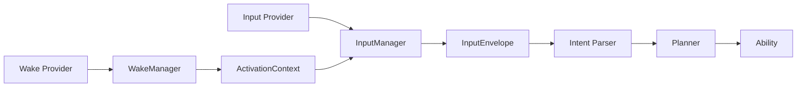

# Sprint 19 Release Review

## Decision

Sprint 19 is complete at `v1.1.0-wake-input`.

The planned Sprint 19.3 Integration and Diagnostics phase is removed. Its scope
was completed during Sprint 19.2 through live Wake and Input integration,
privacy-safe diagnostics, calibration, room testing, and automated regression.

## Delivered

- Provider-driven Clap, microphone Wake Word, Keyboard, Touch Portal, Mobile,
  and API activation contracts.
- Shared microphone lifecycle that disables Wake monitoring during command
  STT, TTS playback, and Follow-up Listening.
- PCM Double Clap detection with refractory, release, adaptive second-clap,
  settle, and Triple cancellation states.
- Privacy-safe detector and InputEnvelope diagnostics without retained audio or
  raw command content.
- Per-device calibration v2 with atomic local profile storage and complete
  two-clap trial enforcement.
- Automated regression and live no-STT probe tooling.

## Verification

- Full local suite: `860 passed, 2 skipped`.
- GitHub Actions: passed for calibration trial enforcement.
- Double Clap: `9/10` confirmed.
- Single Clap: `10/10`, activation `0`.
- Triple Clap: `5/5` cancelled, activation `0`.
- Keyboard typing, desk impact, door close, and measured media: activation `0`.
- Detector exceptions and duplicate activations: `0`.

## Accepted Boundaries

- Keyboard and Touch Portal expose stable provider contracts; live Windows
  global-hotkey and Touch Portal transport adapters are not implemented yet.
- The measured door-close sequence reached `DOUBLE_PENDING` before a third
  transient cancelled it. The target room produced no activation, so this is
  accepted as a low-frequency residual risk.
- Calibration is device and room specific. A microphone or room change should
  run `python scripts\wake_calibration.py` again.

## Next Milestone

Sprint 20 begins v1.2 Memory: long-term memory, preferences, personal lexicon,
correction memory, and entity relationships.
